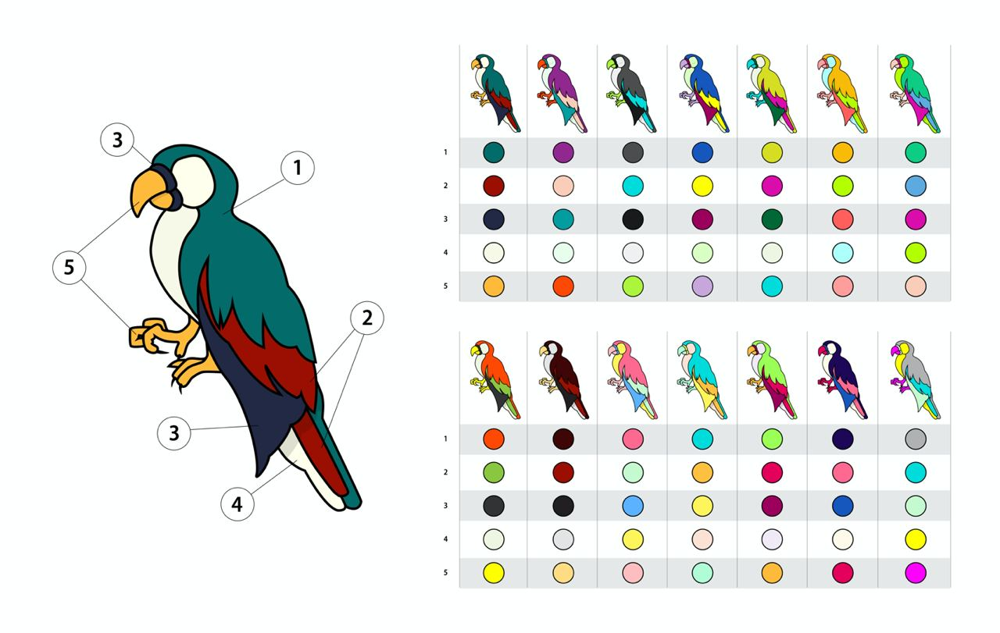

# 🏗 scaffold-eth | 🏰 BuidlGuidl

## 🚩 Challenge 7: 🥩 Composable On Chain SVG NFT

🦸 In this challenge, you will create a web3 application where users can mint svg nfts. This web3 application will also let user upgrade their nft with add on components. Follow the instructions to build your web3 application.

<br>

🌟 The final deliverable is deploying a Dapp that lets users mint nft and upgrade their nft with custom components, then `yarn build` and `yarn surge` your app to a public webserver. Submit the url on [buidlguidl.com](https://buidlguidl.com/)

<br>

💬 Meet other builders working on this challenge and get help in the [Challenge 7 telegram]()!

🧫 Front end for this challenge is already build so no need to change anything enless you want to give your custom look and feel.
<br>

---

### Checkpoint 0: 📦 Install 📚

Want a fresh cloud environment? Click this to open a gitpod workspace, then skip to Checkpoint 1 after the tasks are complete.

[](https://gitpod.io/#https://github.com/scaffold-eth/scaffold-eth-challenges/tree/challenge-composable-onchain-svg-nft)

```bash

git clone https://github.com/scaffold-eth/scaffold-eth-challenges.git challenge-composable-onchain-svg-nft

cd challenge-composable-onchain-svg-nft

git checkout challenge-composable-onchain-svg-nft

yarn install

```

### Checkpoint 1: 🔭 Environment 📺

You'll have three terminals up for:

```bash
yarn start   (react app frontend)
yarn chain   (hardhat backend)
yarn deploy  (to compile, deploy, and publish your contracts to the frontend)
```

> 💻 View your frontend at http://localhost:3000/

> 👩‍💻 Rerun `yarn deploy --reset` whenever you want to deploy new contracts to the frontend.

---

✏ Need to troubleshoot your code? If you import `hardhat/console.sol` to your contract, you can call `console.log()` right in your Solidity code. The output will appear in your `yarn chain` terminal.

### Checkpoint 2: Explore 🦜 assets svg file

In `packages/assets/` you will find the SVG files required for this challenge. Descriptions of each files is as follows:

- BaseParrot - This file tell about components of base parrot body. And possible color combination each set fo components can take.
  <br>
  

- Layer Guild - This file tell what different types of component aka accessories this parrot can wear like eye, head, neck, perch & background.
  <br>
  

- Finished final NFT - This is how a finished NFT will look like if added all the components.
  <br>
  

---

### Checkpoint 3.0: 🧑‍💻 Create data structure to store color sets

`YourCollectible.sol` constructor had 5 color sets. You need to create a storage variable near comment `YOUR_STORAGE_DS_HERE`. We will use this data structure to fetch the color set. Choose a data structure such that we first find the set and then color value via random access like `YOUR_STORAGE_DS_[colorSetIndex][colorIndex]`.

<details>
  <summary>Solution</summary>

```solidity
mapping(uint256 => mapping(uint256 => string)) public colorPallet;
```

</details>

### Checkpoint 3.1: 🧑‍💻 Populate color sets in constructor

Once you figure out data structure, you need to populate that with color data commented in constructor.

<details>
  <summary>Solution</summary>

```solidity
colorPallet[0][0] = "056b68";
colorPallet[0][1] = "9b0e00";
colorPallet[0][2] = "222844";
colorPallet[0][3] = "f7f8e7";
colorPallet[0][4] = "ffb93b";
        ...
```

</details>

### Checkpoint 3.2: 🧑‍🏫 Understand ParrotMeta struct

This structure contains single entry i.e color index a given parrot has. We are filling this value in `mintItem` method. Take this information into account while solving next checkpoint 3.3

```solidity
  struct ParrotMeta {
      uint256 colorIndex;
  }
```

```solidity
parrots[id].colorIndex = uint256(((uint8(predictableRandom[3]) << 8) | uint8(predictableRandom[4])) %4;
```

### Checkpoint 3.3: 🔍️ Find color set index given token id

In contract `getPropertiesById` method, you need to return the color set index given the token id of nft. Can you fill this function with using information from 3.2 checkpoint?

<details>
  <summary>Solution</summary>

```solidity
pallet = parrots[id].colorIndex;
```

</details>

### Checkpoint 3.4: 🔍️ Find all color value

In contract `renderTokenById` method, you need 5 color value for a given token id. Could you think of way to get these color value?

hint - Can you use getPropertiesById to get color set index for a given token?

hint2 - Can you use color data member you created in checkpoint 3.0 to find all color values?

<details>
  <summary>Solution</summary>

```solidity
uint256 pallet = getPropertiesById(id);

string memory color0 = colorPallet[pallet][0];
string memory color1 = colorPallet[pallet][1];
string memory color2 = colorPallet[pallet][2];
string memory color3 = colorPallet[pallet][3];
string memory color4 = colorPallet[pallet][4];
```

</details>

### Checkpoint 4.0: ⚒️ Build base parrot NFT ⏳️

In contract file `BodyLibrary.sol` some methods return empty string. You need to fill all those methods with appropriate string wrapping svg of given part like tail, feet and body.
<br>

### Checkpoint 4.1: 🔍️ Explore base parrot SVG

Open `Packages/assets/ParrotBody.svg` and collapse all `<g>` tag by componets. You will see it will look like as follows.

```svg
<g class="cls-1">
  <g id="Tail">
    ...
  </g>
  <g id="feet">
    ...
  </g>
  <g id="Body">
    ...
  </g>
</g>
```

Here `Tail Foot Body`enclose the code that build that part.

### Checkpoint 4.2: 🧑‍🏫 Understand GetTail function

`GetTail` function in contract file `BodyLibrary.sol` is implemented by just copying code from `<g id="Tail">` inside `abi.encodePacked(` and replaced hardcoded color value with arguments.
<br>

### Checkpoint 4.3: Let try deploy

before processed further lets if GetTail function is correctly implemented. Run following command

```bash
yarn deploy
or
yar deploy --reset
```

### Checkpoint 4.4: 🛑 CompilerError: Stack too deep ?

Comilation will fail with error message `Stack too deep` because in GetTail function we are using `abi.encodePacked` and here each line is separate argument and that causes compilation error. To fix this we just need to break `abi.encodePacked` into smaller parts such that no call has more that 5-7 lines. Here is how you do this.

<details>
  <summary>Solution</summary>

```solidity
string memory tail = string(
    abi.encodePacked(
        "<path",
        '     class="cls-2"',
        '     style="fill:#',
        color1,
        '"',
        '     d="M619.94,780.71s12.83,18.49,16.88,19.78,8.64,3.19,14.52,1.62,9-8.46,9.15-12.54-68.36-143.87-68.81-148,3.06-23.23-.52-39.09-32.67-73.35-32.67-73.35l-31,38.68Z"',
        " />"
    )
);
tail = string(
    abi.encodePacked(
        tail,
        "<path",
        '     class="cls-3"',
        '     style="fill:#',
        color3,
        '"',
        '     d="M477,629.75s34.39,69.37,52.46,85.69,30.9,19.23,30.9,19.23,31.78,60.35,56,70.15c3.87,1.57,9.93.55,12.82-.78,2.19-1,4.16-4.43,2.72-8.55C623.28,771,565.57,692.36,550.6,668.42c-17.49-28-52.65-90-52.65-90Z"',
        " />"
    )
);
tail = string(
    abi.encodePacked(
        tail,
        "<path",
        '     class="cls-4"',
        '     style="fill:#',
        color2,
        '"',
        '     d="M506.69,590.31s47.8,105.31,74.61,142.23,31.09,40.8,35,43.52,4.66,4.66,11.27,3.89,9.71-3.89,9.71-7.78-61.4-124.35-69.56-139.51-34.2-71.89-34.2-71.89Z"',
        " />"
    )
);
tail = string(
    abi.encodePacked(
        tail,
        '<g class="cls-5">',
        "    <path",
        '     class="cls-6"',
        '     d="M583.63,629.75A23.59,23.59,0,0,0,589,626.5a46.48,46.48,0,0,1,3.26,4.84c.6-8,1.1-19-1.12-28.83-3.58-15.86-32.67-73.35-32.67-73.35L477,629.75s32.08,64.71,50.56,83.83c12.4-13.51,26.53-34.77,27-45.36C576.64,663.56,584.22,635,583.63,629.75Z"',
        "     />",
        "</g>"
    )
);
```

</details>

> > > You need to do same for whenever arguments to `abi.encodePacked` are more that 5-7.

### Checkpoint 4.5: ⚒️ Complete GetFeet and GetBody method

Similar to checkout 4.0 complete `GetFeet` and `GetBody`.
<br>

### Checkpoint 4.6: Deploy the contract again

```bash
yarn deploy
or
yar deploy --reset
```

#### 🥅 Goals

- [ ] Can you mint base parrot NFT?
- [ ] Did minted parrot has correct value for body, tail and feet?

---

### Checkpoint 5: 👁️ Build EYE NFT

Components are separate NFT components that gets added to base parrot. So in `Eye.sol` we are creating a EYE component NFT just like we create base parrot NFT. You don't need to change anything in `Eye.sol`. All you need to do is complete the methods in `EyeLibrary.sol` file for each type of eye i.e `angry`,`glasses`,`monocle`,`red`,`cross`
<br>

### Checkpoint 5.0: Angry 😠 eye implementation

In `EyeLibrary.sol` you will see index 0 is already implemented. Let understand that. Notice that style part is copied too unlike base parrot. Because in base parrot we have style in a different file and for accessories we have to provide style with each type of eye.

Rest is same as base parrot where code from `<g id="Eye">` is copied.
<br>

### Checkpoint 5.1: Implement all eye types ⏳️

Similar to checkpoint 5.0 complete rest of switch cases. Remember to copy the styles part and remaining classes as `cls-eye-x` because we don't want to overwrite the class of base parrot.

### Checkpoint 5.2: Deploy eye contract

You don't need to change anything to deploy eye contract. But let see how that is done. In `package/hardhat/deploy` we have deploy script for each contract file. You can explore the deploy script to get better understanding of it.

For now just run any of the following commands

```bash
yarn deploy
or
yar deploy --reset
```

#### 🥅 Goals

- [ ] Can you mint individual EYE component NFT?

---

### Checkpoint 6: Upgrade base NFT with component

Let add eye contract as to base contact. Uncomment the following line in `package/hardhat/deploy/02_deploy_your_collectible.js`

```js
const Eye = await deployments.get("Eye", deployer);
```

```js
await YourCollectible.addNft(Eye.address);
```

#### 🥅 Goals

- [ ] Can user upgrade their base parrot NFT with eye component?
      <br>

---

### ⚔️ Side Quests

- [ ] Can you build other remaining components i.e Head, Neck, Perch & Background?

---

### Checkpoint 7: 🚢 Ship it 🚁

📡 Edit the `defaultNetwork` to [your choice of public EVM networks](https://ethereum.org/en/developers/docs/networks/) in `packages/hardhat/hardhat.config.js`

👩‍🚀 You will want to run `yarn account` to see if you have a **deployer address**

🔐 If you don't have one, run `yarn generate` to create a mnemonic and save it locally for deploying.

⛽️ You will need to send ETH to your **deployer address** with your wallet.

> 🚀 Run `yarn deploy` to deploy your smart contract to a public network (selected in hardhat.config.js)

---

### Checkpoint 8: 🎚 Frontend 🧘‍♀️

> 📝 Edit the `targetNetwork` in `App.jsx` (in `packages/react-app/src`) to be the public network where you deployed your smart contract.

> 💻 View your frontend at http://localhost:3000/

📡 When you are ready to ship the frontend app...

📦 Run `yarn build` to package up your frontend.

💽 Upload your app to surge with `yarn surge` (you could also `yarn s3` or maybe even `yarn ipfs`?)

> 😬 Windows users beware! You may have to change the surge code in `packages/react-app/package.json` to just `"surge": "surge ./build",`

⚙ If you get a permissions error `yarn surge` again until you get a unique URL, or customize it in the command line.

> 📝 you will use this deploy URL to submit to [SpeedRunEthereum.com](https://speedrunethereum.com).

🚔 Traffic to your url might break the [Infura](https://infura.io/) rate limit, edit your key: `constants.js` in `packages/ract-app/src`.

---

### Checkpoint 9: 📜 Contract Verification

Update the api-key in packages/hardhat/package.json file. You can get your key [here](https://etherscan.io/myapikey).


> Now you are ready to run the `yarn verify --network your_network` command to verify your contracts on etherscan 🛰

---

> 🏃 Head to your next challenge [here](https://speedrunethereum.com).

> 💬 Problems, questions, comments on the stack? Post them to the [🏗 scaffold-eth developers chat](https://t.me/joinchat/F7nCRK3kI93PoCOk)
